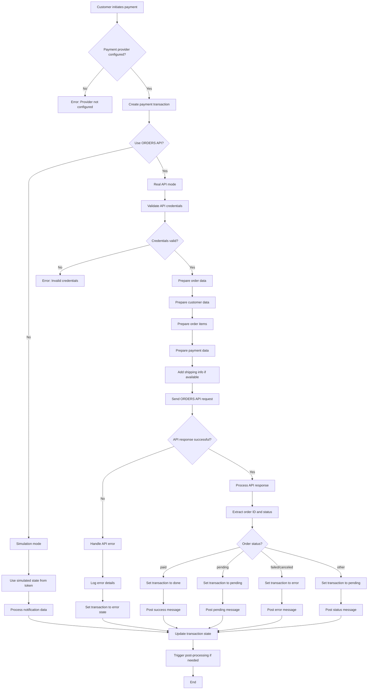
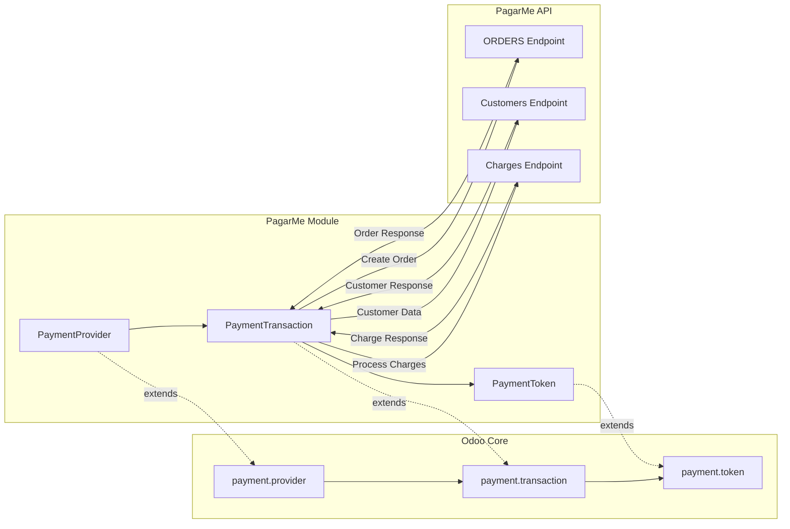
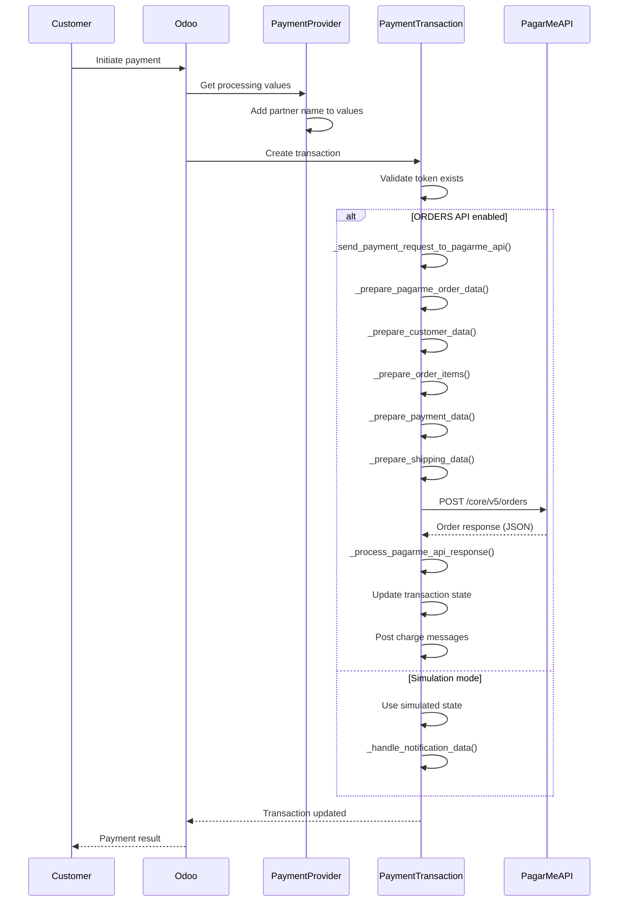
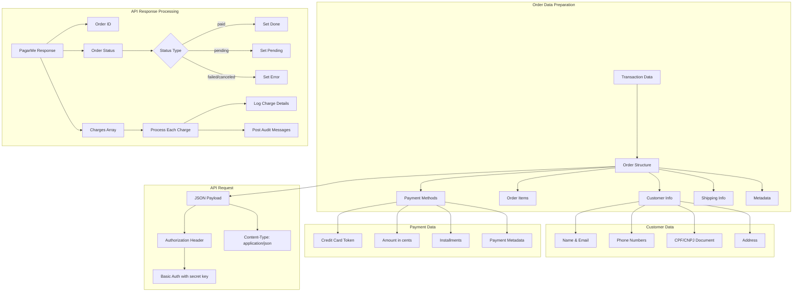
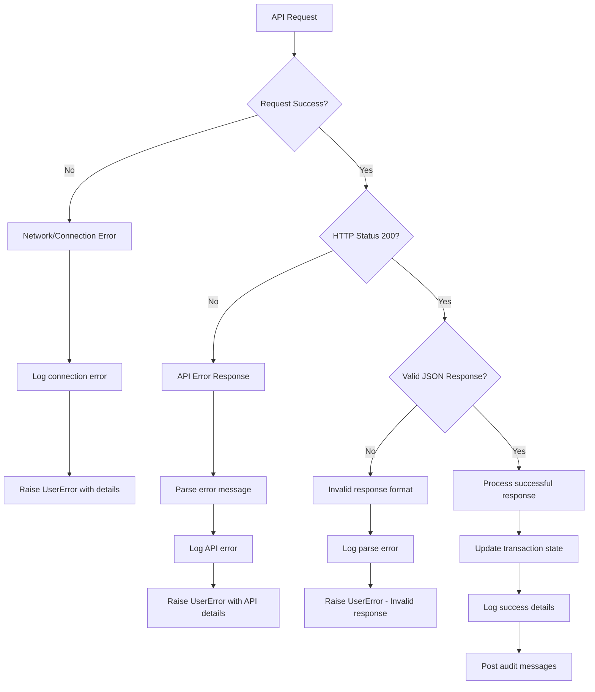
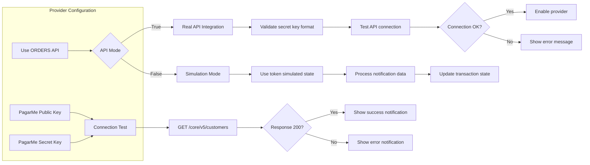

# PagarMe Payment Provider Integration Flow

This document describes the integration flow between Odoo and PagarMe payment provider
using the ORDERS API.

## Payment Processing Flow

## ODOO Payment Framework Integration

## Method Flow Diagram

## API Data Flow

## Error Handling Flow

## Configuration Flow

## Integration Points

### 1. Provider Configuration

- **Fields**: `pagarme_public_key`, `pagarme_secret_key`, `pagarme_use_orders_api`
- **Validation**: Secret key format validation for test/production modes
- **Connection Test**: API connectivity verification

### 2. Transaction Processing

- **Method**: `_send_payment_request()` - Entry point for payment processing
- **API Integration**: `_send_payment_request_to_pagarme_api()` - ORDERS API integration
- **Data Preparation**: Multiple helper methods for API payload construction
- **Response Processing**: `_process_pagarme_api_response()` - Handle API responses

### 3. Backward Compatibility

- **Simulation Mode**: Preserved for existing tests and development
- **Token Support**: Works with both simulated tokens and real API tokens
- **Configuration Toggle**: `pagarme_use_orders_api` setting controls behavior

### 4. Error Handling

- **API Errors**: Structured error processing with detailed logging
- **Network Issues**: Timeout and connection error handling
- **Data Validation**: Input validation before API calls
- **User Feedback**: Clear error messages for administrators and users

### 5. Audit Trail

- **Transaction Logs**: Detailed logging of API interactions
- **Charge Messages**: Posted messages for charge status updates
- **Reference Tracking**: PagarMe order ID stored as provider reference
- **Metadata**: Rich metadata for debugging and audit purposes
