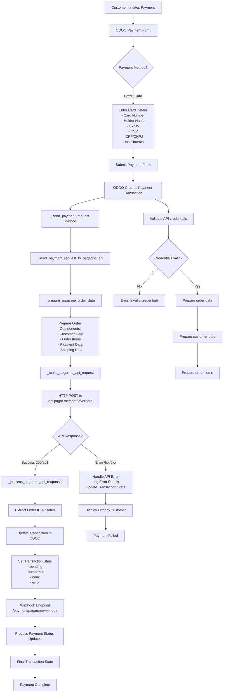
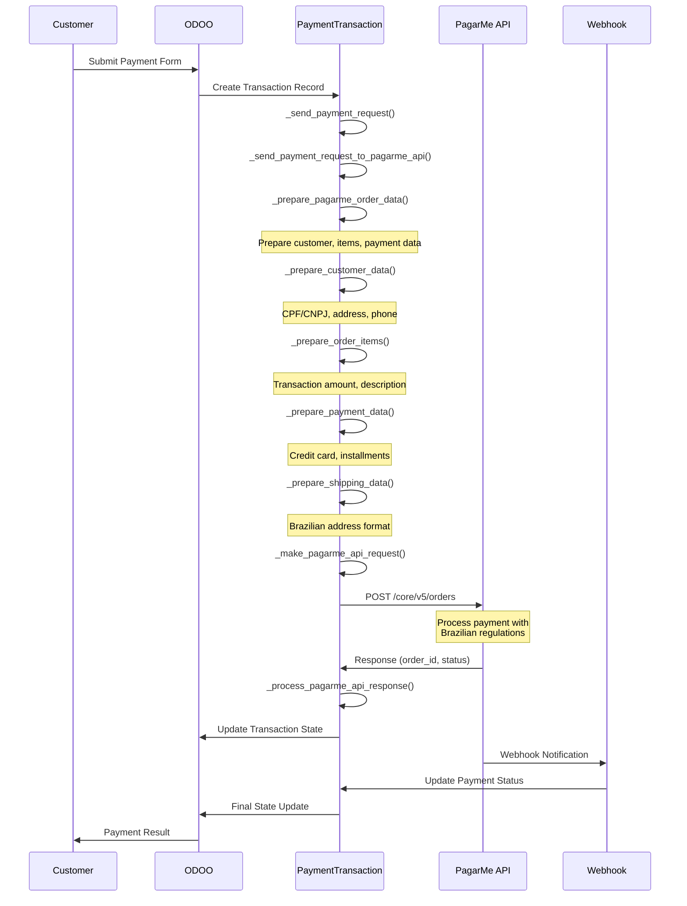
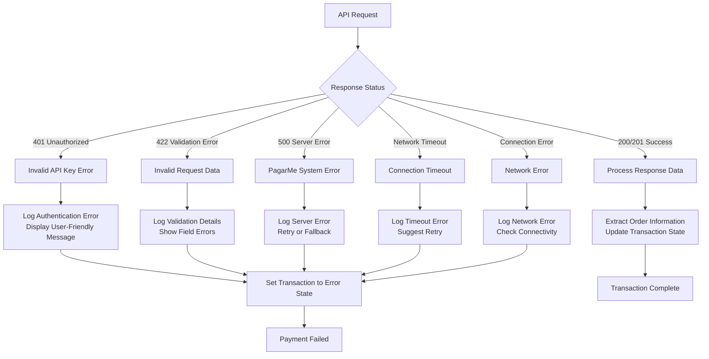

# PagarMe ORDERS API Integration - Payment Flow Documentation

This document provides comprehensive Mermaid flowcharts showing the integration between ODOO and PagarMe payment provider using the ORDERS API.

## 1. Payment Processing Flow



## 2. ODOO Payment Framework Integration

```mermaid
flowchart TD
    A[payment.provider Model] --> B[PaymentProvider Class<br/>l10n_br_payment_pagarme]
    
    B --> C[Configuration Fields:<br/>- pagarme_public_key<br/>- pagarme_secret_key<br/>- state (test/enabled)]
    
    C --> D[Connection Testing:<br/>- action_test_pagarme_connection<br/>- _test_orders_api_connection]
    
    A --> E[payment.transaction Model] --> F[PaymentTransaction Class<br/>l10n_br_payment_pagarme]
    
    F --> G[Payment Methods:<br/>- _send_payment_request<br/>- _send_refund_request<br/>- _send_capture_request<br/>- _send_void_request]
    
    G --> H[PagarMe API Integration:<br/>- _send_payment_request_to_pagarme_api<br/>- _prepare_pagarme_order_data<br/>- _make_pagarme_api_request<br/>- _process_pagarme_api_response]
    
    A --> I[payment.token Model] --> J[PaymentToken Class<br/>l10n_br_payment_pagarme]
    
    J --> K[Token Storage:<br/>- Card Brand<br/>- Last 4 Digits<br/>- Expiry Date<br/>- Provider Reference]
    
    L[Controller<br/>PaymentPagarmeController] --> M[Webhook Endpoint:<br/>/payment/pagarme/webhook]
    
    M --> N[Process Real-time<br/>Payment Notifications]
    N --> O[Update Transaction Status]
```

## 3. Method Sequence Flow



## 4. API Data Flow

```mermaid
flowchart LR
    A[ODOO Transaction Data] --> B[Data Preparation]
    
    B --> C[Customer Data:<br/>- name<br/>- email<br/>- phones<br/>- documents (CPF/CNPJ)<br/>- address]
    
    B --> D[Order Items:<br/>- code<br/>- description<br/>- amount (centavos)<br/>- quantity<br/>- category]
    
    B --> E[Payment Data:<br/>- payment_method<br/>- credit_card token<br/>- installments<br/>- amount]
    
    B --> F[Shipping Data:<br/>- address<br/>- recipient_name<br/>- recipient_phone]
    
    C --> G[PagarMe Order JSON]
    D --> G
    E --> G
    F --> G
    
    G --> H[HTTP POST<br/>api.pagar.me/core/v5/orders<br/>Authorization: Basic base64(secret_key:)]
    
    H --> I[PagarMe Response:<br/>- id (order_id)<br/>- status<br/>- charges array<br/>- customer data<br/>- metadata]
    
    I --> J[ODOO Transaction Update:<br/>- provider_reference<br/>- state mapping<br/>- status message]
```

## 5. Error Handling Flow



## 6. Configuration Flow

```mermaid
flowchart TD
    A[Administrator Access] --> B[Payment Settings]
    B --> C[Create PagarMe Provider]
    
    C --> D[Configure Credentials:<br/>- Public Key<br/>- Secret Key<br/>- Environment (test/prod)]
    
    D --> E[Test Connection]
    E --> F[action_test_pagarme_connection]
    F --> G[_test_orders_api_connection]
    
    G --> H[Create Test Order Structure]
    H --> I[Send to PagarMe API]
    I --> J{Connection Test Result}
    
    J -->|Success| K[Enable Provider<br/>Ready for Payments]
    J -->|Failure| L[Show Error Message<br/>Check Credentials]
    
    K --> M[Provider Available<br/>for Customer Payments]
    L --> N[Fix Configuration<br/>Retry Test]
    
    N --> E
```

## Key Implementation Features

### Real API Integration
- **Complete ORDERS API**: Full integration with PagarMe's core payment API
- **Brazilian Compliance**: CPF/CNPJ document handling, BRL currency, installments
- **Authentication**: Secure Basic authentication with secret key
- **Error Handling**: Comprehensive API error processing with detailed logging

### ODOO Framework Integration
- **Provider Model Extension**: Inherits from `payment.provider`
- **Transaction Model Extension**: Inherits from `payment.transaction`
- **Token Model Extension**: Inherits from `payment.token`
- **Controller Integration**: Real webhook endpoint for notifications

### Data Flow Architecture
- **Preparation Layer**: Multiple specialized methods for data formatting
- **API Communication**: Dedicated HTTP client with proper headers
- **Response Processing**: Status mapping and error handling
- **State Management**: Transaction lifecycle management

### Brazilian Market Features
- **Document Support**: CPF/CNPJ automatic detection and formatting
- **Address Format**: Brazilian postal codes and state handling
- **Payment Methods**: Credit card with installment options (1x to 12x)
- **Currency**: BRL with centavo conversion (amount * 100)

This integration provides a production-ready foundation for Brazilian e-commerce payments using PagarMe's robust payment infrastructure.
